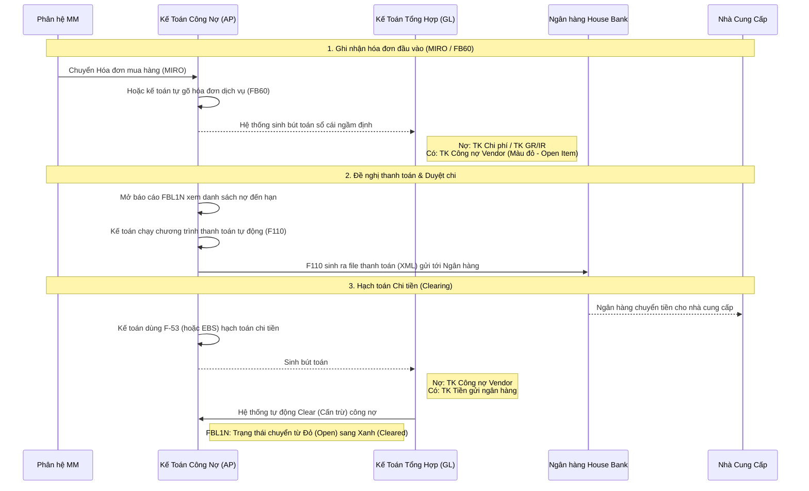

# 📊 Bài 5: Quy Trình Nghiệp Vụ FI Tiêu Biểu Bằng Lưu Đồ

Phân hệ FI có rất nhiều quy trình, nhưng tiêu biểu nhất là quy trình **Quản lý Khoản Phải Trả (Accounts Payable - AP)**. Đây là luồng theo dõi công nợ và chi tiền cho Nhà cung cấp.

### 🔍 Điểm mấu chốt:
1. **Open Item Management (Quản lý hạng mục mở):** Tài khoản Công nợ Vendor luôn được cài đặt tính năng Open Item. Khi mới phát sinh nợ, nó có màu Đỏ. Chừng nào kế toán chưa hạch toán chi tiền (Credit/Debit bằng nhau), nó sẽ mãi mãi màu đỏ. Chỉ khi đối trừ xong (Clearing), nó mới chuyển thành Xanh lá.
2. **T-Code F110 (Automatic Payment Program):** Các tập đoàn lớn không chi tiền lắt nhắt từng món (`F-53`). Họ gom hàng ngàn hóa đơn đến hạn vào chạy `F110` một lần, hệ thống tự động sinh ra một file Ủy nhiệm chi khổng lồ đẩy thẳng sang hệ thống core của Vietcombank/BIDV để giải ngân.
