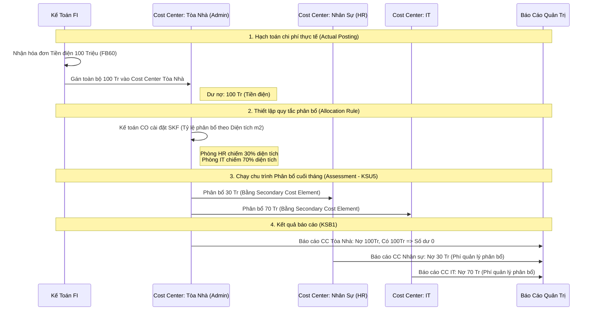

# 📊 Bài 4: Quy Trình Phân Bổ Chi Phí CO Bằng Lưu Đồ

Bài toán hóc búa nhất của Kế toán quản trị (CO) là **"Chia tiền điện chung của cả tòa nhà cho từng phòng ban như thế nào cho công bằng?"**.
Dưới đây là luồng quy trình Phân bổ (Assessment) để giải bài toán đó.

### 🔍 Giải thích khái niệm chuyên sâu:
1. **SKF (Statistical Key Figures):** Là các "Chỉ số thống kê" dùng làm gốc phân bổ. Ví dụ: Số lượng nhân viên, Diện tích mét vuông, Số máy lạnh... Bạn cài đặt SKF này cho từng Cost Center, khi chạy `KSU5`, SAP tự lấy tổng số tiền chia theo tỷ lệ SKF.
2. **Primary vs Secondary Cost Element:** 
   - Lúc FI nhập hóa đơn tiền điện vào Cost Center Tòa Nhà, SAP dùng **Primary Cost Element** (TK Chi phí 642).
   - Lúc CO bốc tiền từ Tòa nhà ném sang HR và IT, SAP dùng **Secondary Cost Element** (Ví dụ mã 900001 - Phí phân bổ nội bộ). Việc này giúp Giám đốc nhìn vào báo cáo HR biết ngay 30 triệu này là "Tiền phân bổ" chứ không phải "Tiền điện trực tiếp phòng HR tự xài". Nó cũng giữ cho bút toán FI không bị thay đổi.
