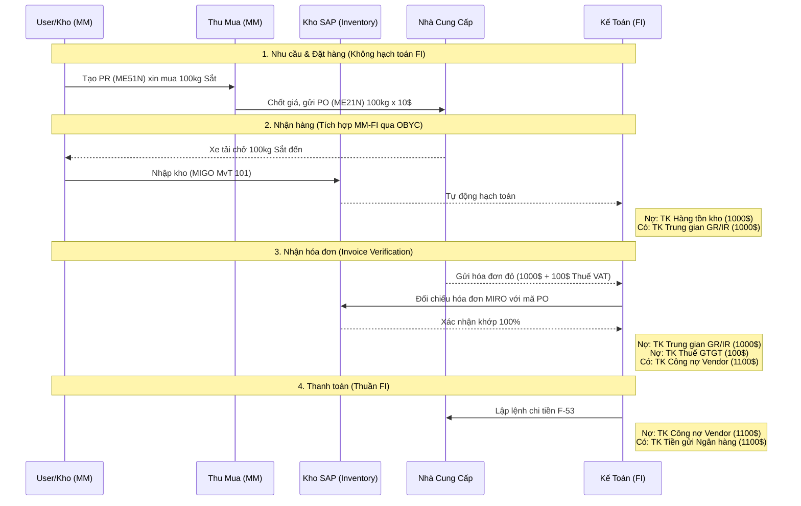

# 📊 Bài 5: Quy Trình Mua Sắm P2P (Procure To Pay) Bằng Lưu Đồ

Để hiểu rõ sự liên kết khổng lồ giữa MM và FI, hãy xem lưu đồ hoạt động bằng **Mermaid** dưới đây. Nó mô tả chính xác sự chuyển dịch dữ liệu qua từng bước.

### 🔍 Phân tích các điểm nghẽn (Choke points) thường gặp:
1. **Lỗi ở bước MIGO:** Nếu tài khoản Hàng tồn kho trong cấu hình OBYC (Mã BSX) chưa được thiết lập cho vật tư "Sắt", lúc bấm nút Lưu trong MIGO, hệ thống sẽ báo lỗi *"Account Determination error"* và không cho nhập hàng vật lý vào.
2. **TK Trung gian GR/IR:** Chức năng của tài khoản này là để "treo" số tiền khi Hàng đã về kho nhưng Hóa đơn đỏ chưa tới (Hoặc ngược lại: Hóa đơn tới nhưng Hàng chưa về). Sau bước MIRO, tài khoản GR/IR sẽ được tất toán về 0. Nếu cuối tháng tài khoản này khác 0, kế toán phải đi tìm hiểu nguyên nhân (Hàng thất lạc hay Vendor quên xuất hóa đơn).
