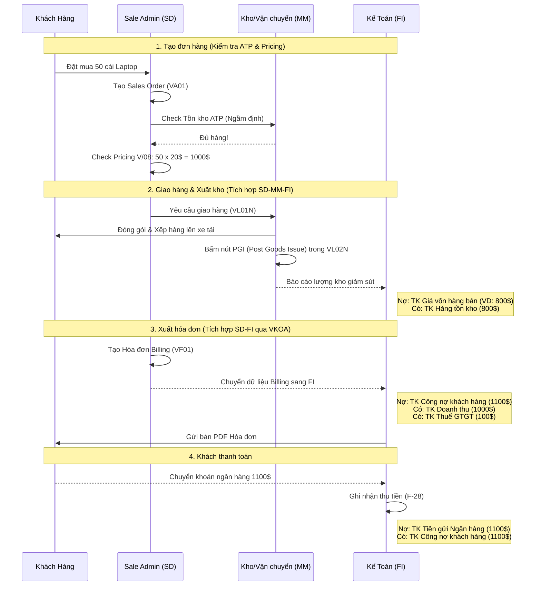

# 📊 Bài 5: Quy Trình Bán Hàng O2C (Order To Cash) Bằng Lưu Đồ

Bán hàng không chỉ là gửi sản phẩm đi. Nó là quy trình kết nối chặt chẽ giữa bộ phận Bán hàng (SD), Kho (MM) và Tài chính (FI). Dưới đây là lưu đồ chi tiết minh họa toàn bộ các bút toán.

### 🔍 Các điểm trọng yếu cần lưu ý (Key Takeaways):
1. **Lệnh tạo Sales Order (VA01) KHÔNG sinh ra bút toán FI.** Nó chỉ là cam kết.
2. **PGI (Post Goods Issue)** trong `VL02N` là thao tác cực kỳ quan trọng. Lúc này, quyền sở hữu hàng hóa chính thức chuyển giao sang khách hàng. Hệ thống trừ tồn kho bên MM (`MB52`), và sinh bút toán tài chính **ghi nhận Giá vốn (COGS)**. 
3. **Billing (VF01)** là bước sinh **Doanh thu**. Hệ thống tự động xác định Tài khoản doanh thu tương ứng nhờ bảng cấu hình **VKOA** (Tùy thuộc vào Nhóm vật tư và Nhóm khách hàng).
