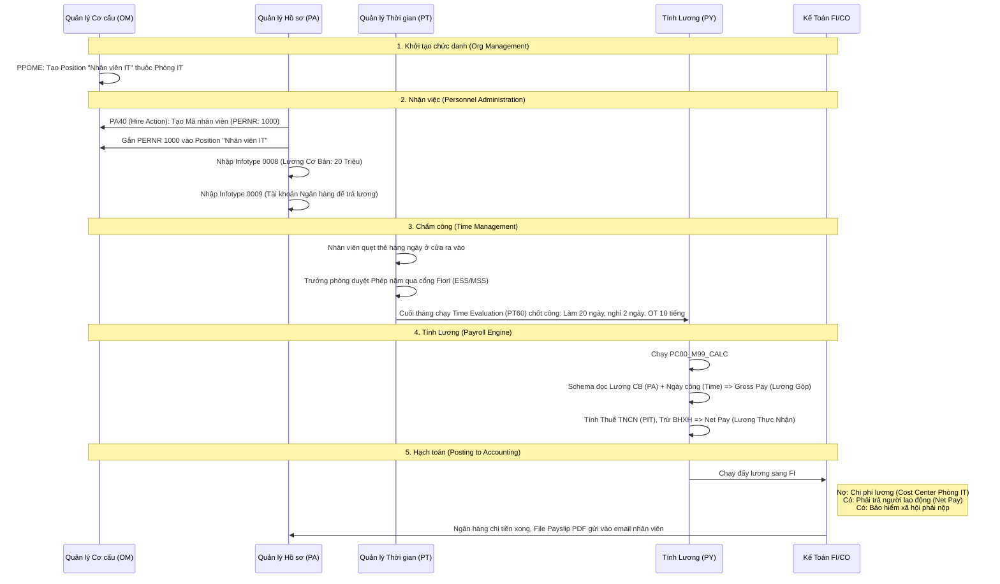

# 📊 Bài 4: Quy Trình Vòng Đời Nhân Viên (Hire-to-Retire) Bằng Lưu Đồ

Phân hệ HCM xử lý dữ liệu con người từ lúc bước chân vào công ty cho đến lúc nghỉ việc, trong đó cốt lõi nhất là luồng **Time & Payroll** (Chấm công & Tính lương).

### 🔍 Giải thích khái niệm chuyên sâu:
1. **ESS / MSS (Employee / Manager Self-Service):** Ứng dụng cổng thông tin (Fiori) cho phép nhân viên tự xin nghỉ phép, tự xem phiếu lương (ESS). Trưởng phòng tự vào duyệt phép, đánh giá KPI cho lính (MSS) mà không cần bộ phận HR nhập liệu hộ (PA30).
2. **Gross-to-Net (Từ Lương gộp xuống Lương thực nhận):** Trái tim của Payroll Engine. Nó xử lý hàng trăm quy tắc luật pháp phức tạp (Như tính thuế lũy tiến từng phần, giới hạn trần đóng BHXH) tự động bằng Schema và Rules.
