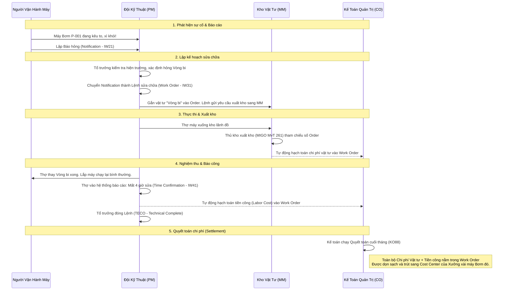

# 📊 Bài 4: Quy Trình Bảo Trì Đột Xuất (Breakdown) Bằng Lưu Đồ

Sự cố máy móc là không thể tránh khỏi. SAP PM thiết kế quy trình **Breakdown Maintenance** rất mượt mà để sửa chữa nhanh nhất nhưng vẫn quản lý chặt chẽ chi phí.

### 🔍 Giá trị quản trị của quy trình này:
1. **Kiểm soát chi phí:** Tổng chi phí bảo dưỡng (Vật tư + Nhân công) được cộng dồn vào từng thiết bị (Equipment). Cuối năm, Giám đốc mở T-Code `MCI8` thấy Máy Bơm P-001 tốn tới 50 triệu tiền sửa chữa, ngang với tiền mua máy mới => Quyết định thanh lý máy.
2. **Quản lý lịch sử (Equipment History):** Lịch sử hỏng hóc (Hỏng ngày nào, ai sửa, sửa lỗi gì) được lưu vĩnh viễn trong Notification. Hỗ trợ Đội kỹ thuật lên phương án Bảo trì phòng ngừa (Preventive Maintenance) tốt hơn trong tương lai.
